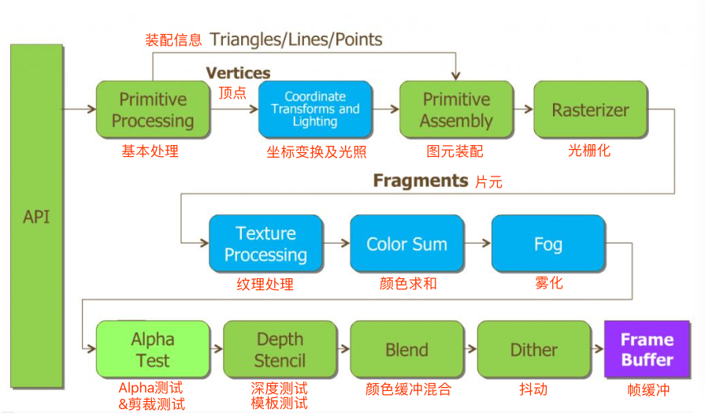

# 第3章 初识OpenGL ES 2.0

## 3.1 OpenGL ES 2.0概览
### 3.1.1 OpenGL ES 2.0简介
经过多年的发展，OpenGL ES主要分为两个主版本：
* OpenGL ES 1.x 采用的是固定渲染管线，可以由硬件GPU支持或用软件模拟实现，渲染能力有限，在纯软件模拟情况下性能也较弱。
* OpenGL ES 2.0 采用的是可编程渲染管线，渲染能力大大提高。OpenGL ES 2.0要求设备中必须要有相应的GPU硬件支持，目前不支持在设备上用软件模拟实现。

### 3.1.2 初识OpenGL ES 2.0应用程序
`ShaderUtil.java`
```java
import android.content.res.Resources;
import android.opengl.GLES20;
import android.util.Log;

import java.io.ByteArrayOutputStream;
import java.io.InputStream;

/**
 * 加载顶点Shader与片元Shader的工具类
 */
public class ShaderUtil {
    /**
     * 加载制定shader的方法
     *
     * @param shaderType shader的类型  GLES20.GL_VERTEX_SHADER(顶点)   GLES20.GL_FRAGMENT_SHADER(片元)
     * @param source     shader的脚本字符串
     * @return
     */
    public static int loadShader(int shaderType, String source) {
        //创建一个新shader
        int shader = GLES20.glCreateShader(shaderType);
        //若创建成功则加载shader
        if (shader != 0) {
            //加载shader的源代码
            GLES20.glShaderSource(shader, source);
            //编译shader
            GLES20.glCompileShader(shader);
            //存放编译成功shader数量的数组
            int[] compiled = new int[1];
            //获取Shader的编译情况
            GLES20.glGetShaderiv(shader, GLES20.GL_COMPILE_STATUS, compiled, 0);
            if (compiled[0] == 0) {//若编译失败则显示错误日志并删除此shader
                Log.e("ES20_ERROR", "Could not compile shader " + shaderType + ":");
                Log.e("ES20_ERROR", GLES20.glGetShaderInfoLog(shader));
                GLES20.glDeleteShader(shader);
                shader = 0;
            }
        }
        return shader;
    }

    /**
     * 创建shader程序的方法
     *
     * @param vertexSource
     * @param fragmentSource
     * @return
     */
    public static int createProgram(String vertexSource, String fragmentSource) {
        //加载顶点着色器
        int vertexShader = loadShader(GLES20.GL_VERTEX_SHADER, vertexSource);
        if (vertexShader == 0) {
            return 0;
        }

        //加载片元着色器
        int pixelShader = loadShader(GLES20.GL_FRAGMENT_SHADER, fragmentSource);
        if (pixelShader == 0) {
            return 0;
        }

        //创建程序
        int program = GLES20.glCreateProgram();
        //若程序创建成功则向程序中加入顶点着色器与片元着色器
        if (program != 0) {
            //向程序中加入顶点着色器
            GLES20.glAttachShader(program, vertexShader);
            checkGlError("glAttachShader");
            //向程序中加入片元着色器
            GLES20.glAttachShader(program, pixelShader);
            checkGlError("glAttachShader");
            //链接程序
            GLES20.glLinkProgram(program);
            //存放链接成功program数量的数组
            int[] linkStatus = new int[1];
            //获取program的链接情况
            GLES20.glGetProgramiv(program, GLES20.GL_LINK_STATUS, linkStatus, 0);
            //若链接失败则报错并删除程序
            if (linkStatus[0] != GLES20.GL_TRUE) {
                Log.e("ES20_ERROR", "Could not link program: ");
                Log.e("ES20_ERROR", GLES20.glGetProgramInfoLog(program));
                GLES20.glDeleteProgram(program);
                program = 0;
            }
        }
        return program;
    }

    /**
     * 检查每一步操作是否有错误的方法
     *
     * @param op
     */
    public static void checkGlError(String op) {
        int error;
        while ((error = GLES20.glGetError()) != GLES20.GL_NO_ERROR) {
            Log.e("ES20_ERROR", op + ": glError " + error);
            throw new RuntimeException(op + ": glError " + error);
        }
    }

    /**
     * 从sh脚本中加载shader内容的方法
     *
     * @param fname
     * @param r
     * @return
     */
    public static String loadFromAssetsFile(String fname, Resources r) {
        String result = null;
        try {
            InputStream in = r.getAssets().open(fname);
            int ch = 0;
            ByteArrayOutputStream baos = new ByteArrayOutputStream();
            while ((ch = in.read()) != -1) {
                baos.write(ch);
            }
            byte[] buff = baos.toByteArray();
            baos.close();
            in.close();
            result = new String(buff, "UTF-8");
            result = result.replaceAll("\\r\\n", "\n");
        } catch (Exception e) {
            e.printStackTrace();
        }
        return result;
    }
}

```

`frag.sh`
``` glsl
precision mediump float;
varying  vec4 vColor; //接收从顶点着色器过来的参数

void main() {                       
   gl_FragColor = vColor;//给此片元颜色值
}
```

`vertext.sh`
``` glsl
uniform mat4 uMVPMatrix; //总变换矩阵
attribute vec3 aPosition;  //顶点位置
attribute vec4 aColor;    //顶点颜色
varying  vec4 vColor;  //用于传递给片元着色器的变量

void main() {                                   
   gl_Position = uMVPMatrix * vec4(aPosition,1); //根据总变换矩阵计算此次绘制此顶点位置
   vColor = aColor;//将接收的颜色传递给片元着色器
}  
```


## 3.2 着色器与渲染管线
### 3.2.1 OpenGL ES 1.x的渲染管线
渲染管线有时也称渲染流水线，一般是由显示芯片（GPU）内部处理图形信号的并行处理单元组成。这些并行处理单元量量之间是相互独立的，在不同型号的硬件上独立处理单元的数量也有很大的差异。一般越高端型号的硬件，其中独立处理单元的数量也就越多。

从另一个角度看，OpenGL ES中渲染管线实质上指的是一系列绘制过程。这些过程输入的是待渲染3D物体的相关描述信息数据，经过渲染管线，输出的是一帧想要的画面。



1. **基本处理**
    设定3D空间中物体的顶点坐标、顶点对应的颜色、顶点的纹理坐标等属性，并且制定绘制方式，如：点绘制、线段绘制或者三角形绘制等。
2. **坐标变换及光照**
    进行顶点变换以及根据程序中设置的光照属性对顶点进行光照计算，顶点变换的任务是对3D物体的各个顶点进行平移、旋转或者缩放等操作。光照计算的任务是根据程序送入的光源位置、性质、各通道强度、物体的材质等，同时再根据一定的光照数学模型计算各顶点的光照情况。
3. **图元装配**
    主要有两个任务，一个是图元组装，一个是图元处理。
    * `图元组装`是指顶点数据根据设置的绘制方式被结合成完整的图元。如，点绘制方式仅需要一个单独的顶点，此方式下每个顶点就是一个图元；线段绘制则需要两个顶点，此方式下每两个顶点构成一个图元；三角形绘制方式下需要三个顶点构成一个图元。

    * `图元处理`最重要的工作时剪裁，其任务是消除位于半空间（half-space）之外的部分几何图元，这个半空间是由一个剪裁平面所定义的。例如，点剪裁就是简单的接收或者拒绝顶点，线段或多边形剪裁可能需要增加额外的顶点，具体取决于直线或者多边形与剪裁平面之间的位置关系。

    剪裁时，若图元完全位于视景体以及自定义`剪裁平面`的内部，则将图元传递到后面的步骤进行处理；如果其完全位于视景体或者自定义剪裁平面的外面，则丢弃该图元；如果其有一部分位于内部，另一部分位于外部，则需要剪裁该图元。

4. **光栅化**

    由于虚拟3D世界中物体的几何信息一般采用连续的数学量来表示，因此投影的平面结果也是用连续数学量表示的。但目前的显示设备屏幕都是离散化的（由一个一个的像素组成），因此还需要将投影的结果离散化。将其分解为一个一个离散化的小单元，这些小单元一般称之为`片元`。

    每个片元都对应于帧缓冲中的一个像素，之所以不直接称之为像素是因为3D空间中的物体是可以相互遮挡的。而一个3D场景最终显示到屏幕上虽然是一个整体，但每个3D物体的每个图元是独立处理的。这就可能出现这样的情况，系统先处理的是位于离观察点较远的图元，其光栅化成为了一组片元，暂时送入帧缓冲的对应位置。但后面继续处理离观察点较近的图元时也光栅化出了一组片元，两组片元中有对应到帧缓冲中同一个位置的，这时距离较近的片元将覆盖距离较远的片元（如何覆盖的检测是在深度检测阶段完成）。因此某片元就不一定能成为最终屏幕上的像素，称之为像素就不准确了，可以将其理解为候选像素。
    > 每个片元包含其对应的顶点坐标、顶点颜色、顶点纹理坐标以及顶点的深度等信息，这些信息是系统根据投影前此片元对应的3D空间中的位置及与此片元相关的图元的各顶点信息进行插值计算而生成的。

5. **纹理处理和颜色求和**
    主要有两个任务：
    * 纹理采样任务 主要是根据当前需处理片元的纹理坐标及采用的纹理id对相应的纹理图进行纹理采样，获取采样值。
    > 纹理采样值就是从纹理图中的某个纹理坐标位置获取的一个颜色值。

    * 颜色求和 主要是执行颜色的变化，其根据纹理采样及光照计算等的结果综合生成需处理片元的颜色。

6. **雾化**

    主要是根据程序中设置的雾的相关参数，如：颜色、浓度、范围等，以及某种雾的数学模型来计算当前处理的片元受雾影响后的颜色。

7. **Alpha测试**

    如果程序中启用了Alpha测试，OpenGL ES会检查每个片元的Alpha值，只有Alpha值符合测试条件的片元才会送入下一个阶段，不满足条件的片元则被丢弃。

8. **剪裁测试**

    如果程序中启用了剪裁测试，OpenGL ES会检查每个片元在帧缓冲中对应的位置，若对应的位置在剪裁窗口中则将此片元送入下一阶段，否则丢弃此片元。

9. **深度测试和模板测试**

    * 深度测试是指将输入片元的深度值与帧缓冲区中存储的对应位置的片元的深度值进行比较，若输入片元的深度值小则将输入片元送入下一阶段准备覆盖帧缓冲中的原片元或与帧缓冲中的原片元混合，否则丢弃输入片元。
    * 模板测试的主要功能为将绘制区域限定在一定的范围内，一般用在湖面倒影、镜像等场合。

10. **颜色缓冲混合**

    若程序中开启了Alpha混合，则根据混合银子将上一阶段送来的片元与帧缓冲中对应位置的片元进行Alpha混合；否则送入的片元将覆盖帧缓冲中对应位置的片元。

11. **抖动**

    抖动允许只使用少量的颜色模拟出更宽的颜色演示范围，从而使颜色视觉效果更加的丰富。使用抖动也有其固有缺点，那就是会损失一部分颜色分辨率，因此对于原生颜色就很丰富的显示设备，一般不需要开启抖动。

12. **帧缓冲**

    OpenGL ES中的物体绘制并不直接在屏幕上进行，而是预先在帧缓冲区中进行绘制，每绘制完一帧再将绘制的结果交换到屏幕上。因此，在每次绘制新的一帧时都需要清除帧缓冲区中的相关数据，否则有可能产生不正确的绘制效果。

    为了应对不同需要，帧缓冲是由一组套件组成的，主要包括颜色缓冲、深度缓冲以及模板缓冲，各组件的具体用途如下所列：
    * 颜色缓冲用于存储每个片元的颜色值，每个颜色值包括RGBA4个色彩通道，应用程序运行时在屏幕上看到的就是颜色缓冲中的内容。
    * 深度缓冲用来存储每个片元的深度值，所谓深度值是指以特定的内部格式表示从片元处到观察点（摄像机）的距离。在启用深度测试的情况下，新片元想进入帧缓冲时需要将自己的深度值与帧缓冲中对应位置片元的深度值进行比较，若结果为小于才有可能进入缓冲，否则被丢弃。
    * 模板缓冲用来存储每个片元的模板值，供模板测试使用。模板测试时集中测试中最为灵活和复杂的一种。

### 3.2.2 OpenGL ES 2.0的渲染管线


OpenGL ES 2.0与1.x的渲染管线的区别：
* OpenGL ES 2.0中“顶点着色器”取代了OpenGL ES 1.x渲染管线中的“变换和光照”阶段，这使得开发3D场景时对顶点的变换、法向量的计算、纹理坐标的变换、光照与材质的应用等均由开发者使用着色器代码完成，灵活性大大增强，可以轻松实现很多OpenGL ES 1.x难以完成的顶点处理任务。
* OpenGL ES 2.0中的“片元着色器”取代了OpenGL 1.x渲染管线中的“纹理环境和颜色求和”、“雾化”以及“Alpha测试”等阶段，这使得纹理处理、颜色求和以及雾化等效果均由开发者自行开发，大大增强了程序对片元的处理能力，可以轻松实现很多OpenGL ES 1.x难以完成的片元处理任务。


1. **顶点着色器**

    顶点着色器是一个可编程的处理单元，功能为执行顶点的变换、光照、材质的应用于计算等顶点的相关操作，其每顶点执行一次。其工作过程为首先将原始的顶点几何信息及其他属性传送到顶点着色器中，经过自己开发的顶点着色器处理后产生纹理坐标、颜色、点位置等后继流程需要的各项顶点属性信息，然后将其传递给图元装配阶段。

    工作原理：
    
    * 输入主要为待处理顶点相应的attribute（属性）变量、uniform（全局）变量、采样器以及临时变量，输出主要为经过顶点着色器后生成的varying（易变）变量及一些內建输出变量。
    * attribute变量 指3D物体中每个顶点各自不同的信息所属的变量，一般顶点的位置、颜色、法向量等每个顶点各自不同的信息都是以attribute变量的方式传入顶点着色器的。
    * **uniform变量** 指对于同一组顶点组成的单个3D物体中所有顶点都相同的量，一般为场景中当前的光源位置、当前的摄像机位置、投影系列矩阵等。
    * **varying变量** 是从顶点着色器计算产生并传递到片元着色器的数据变量。顶点着色器可以使用易变变量来传递需要插值到片元的颜色、法向量、纹理坐标等任意值。
    * **內建输出变量** *gl_Position*、*gl_FrontFacing*和*gl_PointSize*等。gl_Position是经过变换矩阵变换、投影后的顶点的最终位置，gl_FrontFacing指的是片元所在面的朝向，gl_PointSize指的是点的大小。

    易变变量在顶点着色器复制后并不是直接将赋的值送入到后继的片元着色器中，而是在光栅化阶段由管线根据片元所属图元各个顶点对应的顶点着色器对此易变变量的赋值情况及片元与各顶点的位置关系插值产生。

2. **片元着色器**

片元着色器是用于处理片元值及其相关数据的可编程单元，其可以执行纹理的采样、颜色的汇总、计算雾颜色等操作，每片元执行一次。片元着色器主要功能为通过重复执行（每片元一次），将3D物体中的图元光栅化后产生的每个片元的颜色等属性计算出来送入后继阶段，如剪裁测试、深度测试及模板测试等。

从渲染管线的图中可以看出，可编程片元着色器替代了纹理、颜色求和、雾以及Alpha测试等阶段。

工作原理：


* **Varying0~n** 指的是从顶点着色器传递到片元着色器的易变数据变量，由系统在顶点着色器后的光栅化阶段自动插值产生。其个数是不一定的，取决于具体的需要。

* **gl_FragColor** 指的是计算后此片元的颜色。一般在片元着色器的最后都需要对gl_FragColor进行赋值。


### 3.2.2 OpenGL ES中立体物体的构建
OpenGL ES中之所以仅仅支持三角形而不支持任意多边形是处于性能的考虑。

OpenGL中采用的是三维笛卡尔坐标系：

