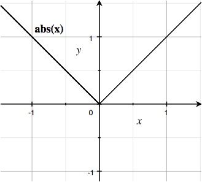
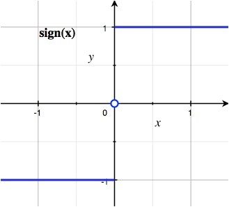
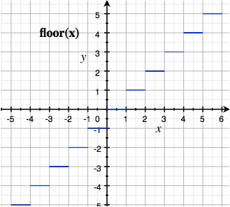
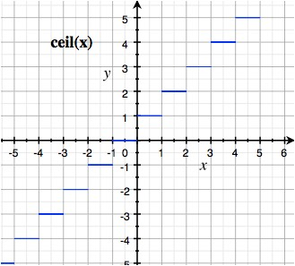
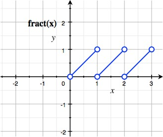

# 第4章 着色语言

## 4.1 着色语言概述
OpenGL ES着色语言主要包含以下特性：
* OpenGL ES着色语言是一种高级的过程语言
* 对顶点着色器、片元着色器使用的是同样的语言，不做区分
* 基于C/C++的语法及流程控制
* 完美支持向量、矩阵的各种操作
* 通过类型限定符来管理输入与输出
* 拥有大量的内置函数来提供丰富的功能

## 4.2 着色语言基础

### 4.2.1 数据类型概述
着色语言的原生数据类型以及构建数据类型：
浮点型（float）、整型（int）、矩阵型（matrix）以及向量型（vec2、vec3等）等，总体来说，这些数据类型可以分为标量、向量、矩阵、采样器、结构体以及数组等几类。

1. **标量**

  值只具有大小，不具有方向

  * 布尔型——bool
  * 整数——int

  OpenGL ES着色语言中的整数保证最少支持16位精度（16位精度范围[-65535~65536]）。

  ``` glsl
  int a = 15;         // 十进制
  int b = 015;        // 0开头的字面常量为八进制
  int c = 0x2D;       // 0x开头的字面常量为十六进制
  ```

  * 浮点型——float

  ``` glsl
  float a;              // 声明浮点型
  float b = 2.0;        // 声明变量的同时为变量赋值
  float c, d = 2.56, l; // 声明多个变量时，可以为其中某个变量赋值
  ```

  OpenGL ES着色语言中没有提供多种不同精度的整数与浮点数，因此代码中的字面常量就不需要使用后缀来说明精度了，只要给出值即可。

2. **向量**
  向量可以看做是同样类型的标量组成的。

**各向量类型及说明**

| 向量类型 | 说明 | 向量类型 | 说明 |
| ---- | ---------- | --------- | --------- |
| vec2 | 包含了2个浮点数的向量 | ivec4 | 包含了4个整数的向量 |
| vec3 | 包含了3个浮点数的向量 | bvec2 | 包含了2个布尔数的向量 |
| vec4 | 包含了4个浮点数的向量 | bvec3 | 包含了3个布尔数的向量 |
| ivec2 | 包含了2个整数的向量 | bvec4 | 包含了4个布尔数的向量 |
| ivec3 | 包含了3个整数的向量 |    ||


开发中，有时也可能需要单独访问向量中的某个分量，基本的语法为“<向量名>.<分量名>”，根据目的不同，主要有如下几种用法：

* 将一个向量看做颜色时，可以使用r、g、b、a四个分量名。
* 将一个向量看做位置时，可以使用x、y、z、w等4个分量名，分别代表X轴、Y轴、Z轴、向量的模等4个分量。
* 将一个向量看做是纹理坐标时，可以使用s、t、p、q等4个分量名，其分别代表纹理坐标的不同分量。


3. **矩阵**

  矩阵按尺寸分为2*2矩阵、3*3矩阵、4*4矩阵

| 矩阵类型        | 说明            |
| :------------- | :------------- |
| mat2           | 2*2的浮点数矩阵  |
| mat3           | 3*3的浮点数矩阵  |
| mat4           | 4*4的浮点数矩阵  |
  >着色语言中，矩阵是按列顺序组织的，也就是一个矩阵可以看作由几个列向量组成。

  对于矩阵的访问，可以将矩阵作为列向量的数组来访问。如：matrix为一个mat4，可以使用matrix[2]取到该矩阵的第三列，其为一个vec4；也可以使用matrix[2][2]取得第三列的向量的第三个分量，其为一个float。
  > 从数学上讲，矩阵看做由向量组成时有两种选择：可以将矩阵看做由多个行向量组成或看做由多个列向量组成。虽然不同的选择功能一样，但在具体进行计算时是有所不同的，因此了解OpenGL ES的选择非常重要。

4. **采样器**

  采样器专门用来进行纹理采样的相关操作。一般情况下，一个采样器变量代表一幅或一套纹理贴图。

| 采样器类型      | 说明            |
| :------------- | :------------- |
| sampler2D      | 用于访问二维纹理 |
| sampler3D      | 用于访问三维纹理 |
| samplerCube    | 用于访问立方贴图纹理 |

  与前面集中变量类型不同，采样器变量不能在着色器中初始化。一般情况下，采样器变量都用uniform限定符来修饰，从宿主语言（如Java）接收传递进着色器的值。
  > sampler3D并不是在所有的OpenGL ES实现中都支持，因此若要使用必须首先在着色器代码中进行设置，打开相应的扩展。

5. **结构体**

  着色语言还提供了类似于C语言中的用户自定义结构体，同样也是使用struct关键字进行声明，基本用法如下：
  ``` glsl
  struct info {         // 声明一个结构体info
    vec3 color;         // 颜色成员
    vec3 position;      // 位置成员
    vec2 textureColor;  // 纹理坐标成员
  }
  info CubeInfo;        // 声明了一个info类型的变量
  ```

6. **数组**

  声明方式：
  1. 声明数组的同时，指定数组的大小：
  ``` glsl
  vec3 position[20];         // 声明了一个包含20个vec3的数组，索引从0开始
  ```
  2. 在声明数组时，可以不指定大小，但是必须符合下列两种情况之一：
    * 引用数组之前，要在此使用上面的声明方式来声明数组
    ``` glsl
    vec3 position[];         // 声明了一个大小不指定的vec3数组
    vec3 position[5];        // 再次声明，并指定大小
    ```
    * 代码中访问数组的下标都是编译时常量，这时编译器会自动创建适当大小的数组，是的数组石村足够存储编译器看到的最大索引值对应的元素
    ``` glsl
    vec3 position[];                    // 声明了一个大小不指定的vec3数组
    vec3 position[3] = vec(3.0);        // position需要一个大小为4的数组
    ```

7. **空类型**

  空类型使用void表示，仅用来声明不返回任何值的函数
  ``` glsl
  void main()                    // 声明了一个返回空类型的main方法
  {
    // 具体操作省略    
  }        
  ```

### 4.2.2 数据类型的基本使用

1. **声明、作用域及初始化**

  向量的初始化有一些灵活变化的技巧：
  ``` glsl
  float a = 12.3;
  float b = 11.4;
  vec2 va = vec2(2.3, 2.5);
  vec2 vb = vec2(a, b);
  vec3 vc = vec3(vb, 13.5);
  vec4 vd = vec4(va, vb);
  vec4 ve = vec4(0.2);            // 声明了4维向量ve并赋值，相当于vec4(0.2, 0.2, 0.2, 0.2)
  ```

  矩阵的初始化技巧：
  ``` glsl
  mat3 ma = mat3(2.0);            //通过给出1个字面常量初始化3*3矩阵
  ```
  > 若矩阵只有对角线上有值且相同，可以采用如上简化语法进行初始化，其等同于mat3(2.0, 0.0, 0.0, 0.0, 2.0, 0.0, 0.0, 0.0, 2.0)

2. **变量初始化的规则**
  * 变量初始化方式：变量可以在声明的时候进行初始化
  * 用const限定符修饰的变量必须在声明的时候进行初始化
  * 属性变量、一致变量以及易变变量在声明的时候一定不能进行初始化


### 4.2.3 运算符

**运算符列表（按照优先级顺序排列）**

| 运算符          | 说明            |
|----------------|---------------- |
| [ ]            | 用于索引         |
| .              | 用于成员选择与混合 |
| ++ --          | 自加1与自减1 后缀 |
| ++ --          | 自加1与自减1 前缀 |
| - !            | 一元非与逻辑非    |
| * /            | 乘法与除法       |
| + -            | 加法与减法       |
| < > <= >=      | 关系运算符       |
| == !=          | 等于及不等于      |
| &&             | 逻辑与           |
| ^^             | 逻辑抑或         |
| \|\|           | 逻辑或           |
| ? :            | 选择            |
| = += -= *= /=  | 赋值运算符       |

1. **索引**

  在着色语言中，索引的起始下标也是0

  索引常用在对数组、向量或者矩阵的操作中，通过索引操作，可以方便的获取数组、向量或者矩阵中包含的各种元素

2. **混合运算**

  在运算符“.”之后列出一个向量中需要的各个分量的名称，就可以选择并重新排列这些分量。

  ``` glsl
  vec4 color = vec4(0.7, 0.1, 0.5, 1.0);      // 声明一个vec4向量
  vec3 temp = color.agb;                      // 相当于拿到一个向量(1.0, 0.1, 0.5)赋值给temp
  vec4 tempL = color.aabb;
  vec3 tempLL;
  tempLL.grb = color.aab;                     // 对向量tempLL的3个分量赋值
  ```
  * 一次混合最多只能列出4个分量名称，且一次出现的各部分的分量名称必须来自同一名称组。3个名称组分别为：xyzw、rgba、stpq
  * 各分量的名称在进行混合时可以改变顺序以进行重新排列
  * 以赋值表达式中的“=”为界，其左侧称之为L值（要写出的表达式），右侧称之为R值（所读取的表达式）。进行混合时，R值可以使用一个向量的各个分量任意的组合以及重复，而L值则不能有任何的重复分量，但可以改变分量顺序。

3. **算术运算符**
  
  自加和自减运算符“++和--”执行的操作与C语言中相同，若在向量或矩阵中使用，每个元素都加1或减1。
  * 向量用算术运算符运算时，执行的是各分量的算术运算。
  * 关于向量与矩阵以及矩阵与矩阵的乘法都是执行的满足线性代数定义的运算。
  
4. **其他运算符**
  * 关系运算符(<、>、<=、>=)只能用在浮点数或者整数标量的操作中，通过关系运算符的运算将产生一个布尔型的值
  * 等于运算符(==、!=)可以用在除数组意外任何类型数据的操作中，在等于操作中将对左右两个操作数的每一个分量分别进行比较，然后得出一个布尔型的值，说明左右两个操作数是否完全相等。
  * 逻辑运算符(&&、||、!、^^)包括四种操作类型，这些操作只可以用在类型为布尔标量的表达式中，不可以用在矩阵中。
  * 选择运算符(?:)可以用在除数组之外的任何类型中。但是要注意，第2个以及第3个表达式必须是相同的类型。
  * 赋值运算符中最常用的“=”在操作时，要求符号两边的操作数必须类型完全相同。***这一点很特殊***，着色语言中的赋值没有自动类型转换或提升功能。

### 4.2.4 类型转换

  着色语言没有提供类型的自动提升功能，并且对类型的匹配要求十分严格。例如，赋值表达式中的两个操作数类型必须完全相同，另外调用函数时的形参以及实参的类型也必须完全相同。

  同时，着色语言也没有提供数据类型的强制转换功能，只能使用构造函数来完成类型转换。
  ``` glsl
  float f = 1.0;
  bool b = bool(f);             // 将浮点数转换成布尔类型，将非0的数字转为true，0转换为false
  float fl = float(b);          // 将布尔值转变为浮点数，true转换为1.0，false转换为0.0
  ```

### 4.2.5 限定符

| 限定符          | 说明            |
|----------------|---------------- |
| attribute      | 一般用于每个顶点都不同的量，比如顶点位置、颜色等 |
| uniform        | 一般用于对同一组顶点组成的单个3D物体中所有顶点都相同的量，如当前的光源位置 |
| varying        | 用于从顶点着色器传递到片元着色器的量 |
| const          | 用于声明常量 |

  限定符在使用时应该放在变量类型之前，且使用attribute、uniform以及varying限定修饰符的变量必须是全局变量。同时要注意的是，着色语言中没有默认限定符的概念，因此如果有需要，必须为全局变量明确指定需要的限定符。

1. **attribute限定符**
  
  修饰的变量用来接收渲染管线传递进顶点着色器的当前待处理顶点的各种属性值。这些属性值每个顶点各自拥有独立的副本，用于描述顶点的各项特征，如顶点坐标、法向量、颜色、纹理坐标等。

  该限定符只能用在顶点着色器中，不能在片元着色器中使用。且只能修饰浮点数标量、浮点数向量以及矩阵变量，不能用来修饰其他类型的变量。

  对于用attribute限定符修饰的变量，其值是由宿主程序批量传入渲染管线的：
  ```java
  // 声明顶点着色器位置属性引用
  int maPositionHandle;
  // 获取顶点位置属性引用的值
  // mProgram 采用的着色器程序id
  // "aPosition" 着色器中对应的属性变量名称
  maPositionHandle = GLES20.glGetAttribLocation(mProgram, "aPosition");
  // 将顶点位置数据传送进渲染管线
  // 3 每顶点一组的数据个数（这里是x、y、z坐标，因此为3）
  // GL_FLOAT 数据类型
  // false 是否规格化
  // 3 * 4 每组数据的尺寸，这里每组3个浮点数值（x、y、z坐标），每个浮点数4个字节，共12个字节
  // mVertexBuffer 存放了数据的缓冲
  GLES20.glVertexAttribPointer(maPositionHandle, 3, GLES20.GL_FLOAT, false, 3 * 4, mVertexBuffer);
  // 启用顶点位置数据
  GLES20.glEnableVertextAttribArray(maPositionHandle);
  ```
  在传送属性变量的值之前，首先需要按照顶点的次序一次将与此属性变量对应的值送入缓冲：
  ```java
  // 将顶点此项数据依次放入数组，这里是顶点坐标
  float[] vertices = {
    -4 * UNIT_SIZE, 0, 0,
    0, -4 * UNIT_SIZE, 0,
    0, 0, 4 * UNIT_SIZE
  };
  // 开辟对应容量的缓冲
  ByteBuffer vbb = ByteBuffer.allocateDirect(vertices.length * 4);
  // 设置字节顺序为本地操作系统顺序
  vbb.order(ByteOrder.nativeOrder());
  mVertexBuffer = vbb.asFloatBuffer();
  // 将数据送入缓冲
  mVertextBuffer.put(vertices);
  // 设置缓冲起始位置
  mVertextBuffer.position(0);
  ```

2. **uniform**

  可以用在顶点着色器或片元着色器中，其支持用来修饰所有的基本数据类型。

  将一致变量的值从宿主程序传入渲染管线：
  ```java
  // 总变换矩阵，一致变量引用
  int muMVPMatrixHandle;
  // 获取着色器程序中总变换矩阵一致变量的引用
  muMVPMatrixHandle = GLES20.glGetUniformLocation(mProgram, "uMVPMatrix");
  // 通过一致变量引用将一致变量值传入渲染管线
  GLES20.glUniformMatrix4fv(muMVPMatrixHandle, 1, false, Triangle.getFinalMatrix(mMatrix), 0);
  ```

3. **varying**
  
  使用此限定符将顶点着色器中的信息传入到片元着色器中。易变变量可以看成是顶点着色器以及片元着色器之间的动态接口，方便顶点着色器与片元着色器之间信息的传递。

  ***并行硬件处理单元***

  > 顶点着色器一般既声明易变变量，又对易变变量赋值以传递给片元着色器。而片元着色器中声明易变变量用于接收顶点着色器传过来的值即可。

4. **const**

  修饰的变量值是不可以改变的，又称为`编译时常量`，在声明的时候必须进行初始化，同事这些常量在着色器外部是完全不可见的。

  > 用const限定符修饰的变量在编译时，编译器是不需要向其分配任何运行时资源的。


### 4.2.6 流程控制
1. **if-else 条件语句**
2. **while/do-while 循环**
3. **for 循环**
4. **break与continue 循环控制**

> 着色器语言中不包含switch语句


### 4.2.7 函数的声明与使用
基本语法：
> **<返回类型> 函数名称 ([<参数序列>]) { /\*函数体\*/ }**

参数序列除了可以指定类型外，还可以指定用途。具体方法为用参数用途修饰符进行修饰：
* “in” 表示输入参数，仅供函数接收外界传入的值。若某个参数没有明确给出用途修饰符，则等同于使用“in”修饰符
* “out” 表示输出参数，在函数体中对输出参数赋值可以将值传递到调用其的外界变量中。对于输出参数，要注意的是在调用时不可以使用字面常量。
* “inout” 表示输入输出参数，具有输入和输出两种参数的功能。

### 4.2.8 片元着色器中浮点变量精度的指定
片元着色器中使用浮点相关类型的变量时与顶点着色器中有所不同，在顶点着色器中直接声明使用即可，而在片元着色器中必须指定精度，若不指定精度可能会引起编译错误。
```glsl
lowp float color;                 // 指定float型变量精度为lowp
varying mediump vec2 Coord;       // 指定vec2型变量精度为mediump
highp mat4 m;                     // 指定该矩阵类型的变量精度为highp
```

如果在开发中同一个片元着色器中浮点相关类型的变量都选用同一种精度，则可以指定整个着色器中浮点相关类型的默认精度：
> **precision <精度> <类型>**
* 精度可以选择lowp、mediump、highp三种之一
* 类型一般为float

### 4.2.9 程序的基本结构
一个着色器程序一般由3大部分组成，主要包括：全局变量声明、自定义函数、main函数

```glsl
uniform mat4 uMVPMatrix;                // 总变换矩阵
attribute vec3 aPosition;               // 顶点位置
attribute vec2 aTexColor;               // 顶点纹理坐标
varying vec2 vTextureCoord;             

void positionShift() {                  // 根据总变换矩阵计算此次绘制此顶点位置的方法
  gl_Position = uMVPMatrix * vec4(aPosition, 1);
}

void main() {                           // 主函数
  positionShift();              

  vTextureCoord = aTexCoord;            // 将接收的纹理坐标传递给片元着色器
}
```
> 与很多高级语言不同，着色器程序中要求被条用的函数必须在调用之前声明。


## 4.3 特殊的內建变量
一般用来实现渲染管线固定功能部分与自定义顶点或片元着色器之间的信息交互。

根据信息传递的方向可以分为两类，输入与输出变量。输入变量负责将渲染管线中固定功能部分产生的信息传递进着色器，输出变量负责将着色器产生的信息传递给渲染管线中固定功能部分。

### 4.3.1 顶点着色器中的内建变量
主要是输出变量，包括gl_Position、gl_PointSize等。

* gl_Position
  顶点着色器从应用程序中获得原始的顶点位置数据，这些原始的顶点数据在顶点着色器中经过评议、旋转、缩放等数学变换后，生成新的顶点位置。新的顶点位置通过在顶点着色器中写入gl_Position传递到渲染管线的后继阶段继续处理。

  gl_PositionSize的类型是vec4，写入的顶点位置数据也必须与其类型一致。
* gl_PointSize
  顶点着色器中可以计算一个点的大小（单位为像素），并将其赋值给gl_PointSize(标量float类型)以传递给渲染管线。如果没有明确赋值，采用默认值1。gl_PointSize的值一般只有在采用了点绘制方式之后才有意义。

### 4.3.2 片元着色器中的内建变量
1. **内建输入变量**

  主要有gl_FragCoord以及gl_FrontFacing两个，均是只读的。
  * gl_FragCoord
    vec4类型，含有当前片元相对于窗口位置的坐标值x、y、z与1/w。
    > 通过该內建变量可以实现与窗口位置相关的操作，例如仅绘制窗口中指定区域的内容的。

  * gl_FrontFacing
    布尔类型，通过读取该变量的值可以判断正在处理的片元是否属于在光栅化阶段生成此片元对应图元的正面。其一般用于开发双面光照功能相关的应用程序中。

    对于点、线段等没有正反面之分的图元，其生成的片元都会被默认为是正面的。对于三角形图元来说，其正反面取决于应用程序中对卷绕的设置及图元中顶点的具体卷绕情况。

2. **内建输出变量**
  * gl_FragColor
    vec4类型，用来由片元着色器写入计算完成的片元颜色值，此颜色值将送入渲染管线的后继阶段进行处理。
  * gl_FragData
    vec4类型的数组，写入时要给出下标。

  > 实际开发中，上述两个內建输出变量赋值时应该根据具体情况仅选用其中的一个，而不应该同时对两个都进行赋值。

## 4.4 着色语言的内置函数
内置函数按照设计目的可以分为3个类别：
* 提供独特硬件功能的访问接口，如纹理采样系列的函数
* 简单的数学函数，如求模、取整等。
* 一些复杂的函数，如三角函数等。

### 4.4.1 角度转换与三角函数
同时适用于顶点着色器与片元着色器，并且每个角度转换与三角函数都有4种重载变体：

| 内置函数名 | 说明 |
| --------- | -------------------------------------- |
| genType radians(genType degrees) | 此函数功能为将角度转换为弧度，<br>即返回值result=(π/180)*degrees degrees参数表示需要转换的角度 |
| genType degrees(genType radians) | 此函数功能为将弧度转换为角度，<br>即返回值result=(180/π)*radians radians参数表示需要转换的弧度 |
| genType sin(genType angle) | 此函数为标准的正弦函数，其返回值范围是[-1, 1] <br>angle为正弦函数的参数，以弧度为单位 |
| genType cos(genType angle) | 此函数为标准的余弦函数，其返回值范围是[-1, 1] <br>angle为余弦函数的参数，以弧度为单位 |
| genType tan(genType angle) | 此函数为标准的正切函数 <br>angle为正切函数的参数，以弧度为单位 |
| genType asin(genType x) | 此函数为标准的反正弦函数，其返回值范围是[-π/2, π/2] <br>x为反正弦函数的参数，其取值范围是[-1, 1] <br>如果x的绝对值大于1，那么结果不确定 |
| genType acos(genType x) | 此函数为标准的反余弦函数，其返回值范围是[0, π] <br>x为反余弦函数的参数，其取值范围是[-1, 1] <br>如果x的绝对值大于1，那么结果不确定 |
| genType atan(genType y, genType x) | 此函数为标准的反正切函数，其返回值范围是[-π, π] <br>x与y为反正弦函数的参数，而实际传入反正切函数的y/x的值，<br>其中通过x与y的符号用来确定角度所在的象限。<br>如果x与y的值全为0，那么结果不确定 |
| genType atan(genType y_over_x) | 此函数为标准的反正切函数，其返回值范围是[-π/2, π/2] <br>y_over_x为反正弦函数的参数，不存在范围限制 |
> genType代表的数据类型有float、vec2、vec3以及vec4

### 4.4.2 指数函数
同时适用于顶点着色器与片元着色器

| 内置函数名 | 说明 |
| --------- | -------------------------------------- |
| genType pow(genType x, genType y) | 此函数返回x的y次方，x与y分别为本函数的两个参数，<br>其中x为指数函数的底数，y为指数函数的指数，<br>如果x值小于0，那么返回值不确定。<br>如果x值等于0，并且y值小于等于0，那么返回值不确定 |
| genType exp(genType x) | 此函数返回e(数学常数，值近似等于2.718281828)的x次方，<br>x为此函数的参数，代表指数 |
| genType log(genType x) | 此函数返回以e为底的x的对数，也就是说，如果返回值为y，<br>那么也满足方程x=e的y次方。<br>x为本函数的参数。如果x值小于等于0，那么返回值不确定 |
| genType exp2(genType x) | 此函数返回2的x次方，x为本函数的参数，不存在范围限制 |
| genType log2(genType x) | 此函数返回以2为底的x的对数，<br>也就是说，如果返回值为y，那么也满足方程x=2的y次方。<br>x为本函数的参数。如果x值小于等于0，那么返回值不确定 |
| genType sqrt(genType x) | 此函数返回x的平方根，x为本函数的参数，<br>如果x值小于0，那么结果不确定 |
| genType inversesqrt(genType x) | 此函数返回x平方根的倒数，x为本函数的参数，<br>如果x值小于等于0，那么结果不确定 |
> genType代表的数据类型有float、vec2、vec3以及vec4

### 4.4.3 常见函数
同时适用于顶点着色器与片元着色器

| 内置函数名 | 说明 |
| --------- | -------------------------------------- |
| genType abs(genType x) | 此函数的功能为求绝对值。x为本函数的参数，<br>如果x>=0，那么返回值为x，如果x<0，那么返回值为-x |
| genType sign(genType x) | 此函数的功能是与0进行比较，进而返回相应的值。<br>x为本函数的参数，如果x>0，则返回1.0；<br>如果x=0，则返回0；如果x<0，则返回-1.0 |
| genType floor(genType x) | 此函数功能为返回小于或者等于x的最大的整数值 <br>x为本函数的参数，不存在取值范围限制 |
| genType ceil(genType x) | 此函数功能为返回大于或者等于x的最小的整数值 <br>x为本函数的参数，不存在取值范围限制 |
| genType fract(genType x) | 此函数功能为返回x-floor(x)的值 <br>x为本函数的参数，不存在取值范围限制 |
| genType mod(genType x, float y) | 此函数的功能是进行取模运算，<br>相当于Java语言中的“x%y”。<br>对于x中的各组成元素，<br>使用浮点数y，最后返回x-y*floor(x/y) |
| genType mod(genType x, genType y) | 此函数的功能是进行取模运算，<br>相当于Java语言中的“x%y”。<br>对于x中的各组成元素，<br>使用y中的对应组成元素，<br>最后返回x-y*floor(x/y) |
| genType min(genType x, genType y)<br>genType min(genType x, float y) | 此函数的功能是活的最小值。<br>x与y为本函数的两个参数，<br>如果x与y中的组成元素满足y<x，则返回y，否则返回x |
| genType max(genType x, genType y)<br>genType max(genType x, float y) | 此函数的功能是活的最大值。<br>x与y为本函数的两个参数，<br>如果x与y中的组成元素满足y<x，则返回x，否则返回y |
| genType clamp(genType x, genType minVal, genType maxVal)<br>genType clamp(genType x, float minVal, float maxVal) | 此函数主要返回min(max(x, minVal), maxVal)，<br>x、minVal、maxVal为本函数的3个参数，<br>如果minVal>maxVal，则返回值不确定 |
| genType mix(genType x, genType y, genType a)<br>genType mix(genType x, genType y, float a) | 此函数主要功能为使用因子a对x于y执行线性混合，<br>即返回x*(1-a)+y*a |
| genType step(genType edge, genType x)<br>genType step(float edge, genType x) | 此函数通过x与edge比较返回相应的值。<br>edge与x为本函数的两个参数，不存在范围限制。<br>如果x<edge，则返回0.0，否则返回1.0 |
| genType smoothstep(genType edge0, genType edge1, genType x)<br>genType smoothstep(float edge0, float edge1, genType x) | 此函数通过x与edge0、edge1进行比较返回相应的值。<br>edge0、edge1与x为本函数的三个参数，<br>不存在范围限制。<br>如果x<=edge0，则返回0.0，<br>如果x>=edge1，否则返回1.0，<br>当edge0<x<edge1时，<br>本函数则返回0与1之间平滑的Hermite插值。<br>关于Hermite插值，有兴趣可以查阅相关的数学资料。 |

> genType代表的数据类型有float、vec2、vec3以及vec4

* abs函数 可以用来在一个平滑函数中引入间断


* sign函数 其为一个不连续函数


* floor函数 不连续函数，返回参数的整数部分


* ceil函数 不连续函数，返回大于或者等于参数的最小整数


* fract函数 不连续函数，每段的斜率均为1


* min函数
* max函数
* clamp函数 要求传入的minVal必须小于maxVal
* step函数 不连续函数
* smoothstep函数 连续函数，此函数主要用来在两个值之间（0~1）进行平滑过渡


### 4.4.4 几何函数
同时适用于顶点着色器与片元着色器

| 内置函数名 | 说明 |
| --------- | -------------------------------------- |
| float length(genType x) | 此函数的功能是返回向量x的长度，<br>x为本函数的参数，不存在范围限制 |
| float distance(genType p0, genType p1) | 此函数的功能是返回p0与p1之间的距离，<br>即length(p0-p1) <br>p0与p1为本函数的参数，不存在范围限制 |
| float dot(genType x, genType y) | 此函数的功能是返回向量x与y的点积，<br>即x[0]*y[0]+x[1]*y[1]+x[2]*y[2]+... <br>x与y为本函数的的参数，不存在范围限制 |
| vec3 cross(vec3 x, vec3 y) | 此函数的功能是返回向量x与y的叉积 <br>x与y为本函数的的参数，不存在范围限制 |
| genType normalize(genType x) | 此函数功能为返回与向量x方向相同，<br>并且长度为1的向量，<br>也就是对一个向量进行规格化。<br>x为本函数的的参数，不存在范围限制 |
| genType faceforward(genType N, genType I, genType Nref) | 此函数功能是根据dot(Nref,I)的值返回相应的值，<br>如果dot(Nref,I)<0，则返回N，否则返回-N。<br>N、I与Nref为本函数的参数，不存在范围限制 |
| genType reflect(genType I, genType N) | 此函数功能是根据传入的入射向量I以及表面法向量N，<br>返回反射方向的向量。<br>为了得到希望的结果，<br>传入的的表面法向量需要先规格化 |
| genType refract(genType I, genType N, float eta) | 此函数功能是根据传入的入射向量I、<br>表面法向量N以及折射系数eta，返回折射向量。<br>为了得到希望的结果，<br>传入的的入射向量I与表面法向量N需要先规格化 |

> genType代表的数据类型有float、vec2、vec3以及vec4

* dot函数 两个向量点积的符号，与两个向量的夹角是直接相关的。夹角大于0并且小于90°，则结果大于0；夹角等于90°，结果为0；夹角大于90°，则结果小于0。
* cross函数 两个向量叉积的绝对值即为两个向量所在四边形的面积。
* reflect函数 
* refract函数
> 折射系数eta与介质1与介质2的折射率有关，介质1的折射率除以介质2的折射率即为折射系数


### 4.4.5 矩阵函数
同时适用于顶点着色器与片元着色器

| 内置函数名 | 说明 |
| --------- | -------------------------------------- |
| mat matrixCompMult(mat x, mat y) | 此函数按各个部分将矩阵x与矩阵y相乘，<br>即返回值result[i][j]是x[i][j]与y[i][j]标量的乘积 |
> mat代表的数据类型有mat2、mat3以及mat4。本函数是矩阵的标量乘法，若希望进行线性代数中定义的矩阵乘法则需要乘法运算符(*)。


### 4.4.6 向量关系函数
将向量的各分量进行关系比较运算（<, <=, >, >=, ==, !=），生成标量的布尔值结果

| 内置函数名 | 说明 |
| --------- | -------------------------------------- |
| bvec lessThan(vec x, vec y)<br>bvec lessThan(ivec x, ivec y) | 此函数功能是返回向量x与y中的各个分量执行x<y的结果 |
| bvec lessThanEqual(vec x, vec y)<br>bvec lessThanEqual(ivec x, ivec y) | 此函数功能是返回向量x与y中的各个分量执行x<=y的结果 |
| bvec greaterThan(vec x, vec y)<br>bvec greaterThan(ivec x, ivec y) | 此函数功能是返回向量x与y中的各个分量执行x>y的结果 |
| bvec greaterThanEqual(vec x, vec y)<br>bvec greaterThanEqual(ivec x, ivec y) | 此函数功能是返回向量x与y中的各个分量执行x>=y的结果 |
| bvec equal(vec x, vec y)<br>bvec equal(ivec x, ivec y)<br>bvec equal(bvec x, bvec y) | 此函数功能是返回向量x与y中的各个分量执行x==y的结果 |
| bvec notEqual(vec x, vec y)<br>bvec notEqual(ivec x, ivec y)<br>bvec notEqual(bvec x, bvec y) | 此函数功能是返回向量x与y中的各个分量执行x!=y的结果 |
| bool any(bvec x) | 如果x中任何一个分量为true，则返回true |
| bool all(bvec x) | x中的所有组成元素都为true，则返回true |
| bvec not(bvec x) | 对于x中的各个分量执行逻辑非运算 |


### 4.4.7 纹理采样函数
用来根据指定的纹理坐标从采样器对应的纹理中进行采样，返回值类型都是vec4，代表采样得到的颜色值。大部分纹理采样函数既可以用于顶点着色器也可以用于片元着色器，但个别的仅适用于片元着色器

| 内置函数名 | 说明 |
| --------- | -------------------------------------- |
| vec4 texture2D(sampler2D sampler, vec2 coord, [float bias])<br>vec4 texture2DProj(sampler2D sampler, vec3 coord, [float bias])<br>vec4 texture2DProj(sampler2D sampler, vec4 coord, [float bias])<br>vec4 texture2DLod(sampler2D sampler, vec2 coord, float lod)<br>vec4 texture2DProjLod(sampler2D sampler, vec3 coord, float lod)<br>vec4 texture2DProjLod(sampler2D sampler, vec4 coord, float lod) | 此系列函数功能为使用二维纹理坐标coord<br>在由sampler参数指定的2D纹理中执行纹理采样。<br>对于带有Proj后缀的函数，会将纹理坐标<br>(coord.s,coord.t)除以coord的<br>最后一个部分(coord.q)。<br>对于类型为vec4的coord，<br>忽略其第三部分(coord.p) |
| vec4 textureCube(samplerCube sampler, vec3 coord)<br>vec4 textureCube(samplerCube sampler, vec3 coord, float bias)<br>vec4 textureCubeLod(samplerCube sampler, vec3 coord, float lod) | 此函数功能为使用纹理坐标coord<br>在由sampler参数指定的立方图纹理中<br>执行纹理采样。此函数中的coord<br>不再是直接的纹理坐标，<br>而是一个表示方向的向量，<br>通过此向量首先确定要采样的面，<br>再确定面里面的纹理坐标 |
| vec4 texture3DLod(sampler3D sampler, vec3 coord, [float bias])<br>vec4 texture3DProj(sampler3D sampler, vec4 coord, [float bias])<br>vec4 texture3DLod(sampler3D sampler, vec3 coord, float lod)<br>vec4 texture3DProjLod(sampler3D sampler, vec4 coord, float lod) | 此函数功能是使用纹理坐标coord<br>在由sampler指定的3D纹理中<br>执行纹理采样。对于带有Proj后缀的函数，<br>会将纹理坐标(coord.s,coord.t)除以<br>coord的最后一个部分(coord.q)。<br>对于类型为vec4的coord，<br>忽略其第三部分(coord.p)|

1. **bias函数**
  
  含有bias参数的纹理采样函数只能在片元着色器中调用，且此参数仅对sampler为mipmap类型的纹理时才有意义。
  * 若提供了bias参数，且sampler对应的纹理为mipmap类型的，则bias参数会用来参与计算细节级别，产生细节级别后再到对应细节级别的mipmap纹理中执行采样
  * 若没有提供bias参数，且sampler对应的纹理为mipmap类型时，将有系统自动计算细节级别，产生细节级别后再到对应细节级别的mipmap纹理中执行采样
  * 若sampler对应的纹理不是mipmap类型时，直接采用原始纹理进行采样
2. **Lod后缀系列**

  带有Lod后缀的纹理采样函数只适用于顶点着色器，其中的lod(level of detail的缩写)参数将直接用来作为进行mipmap纹理采样时的细节级别。因此，此系列函数也仅对sampler为mipmap类型的纹理才有意义

3. **texture3D系列**

  此系列的纹理采样函数在标准的OpenGL ES 2.0中还没有支持，但部分厂商的产品进行了扩展，支持此系列函数。因此，在使用此系列函数时需要在着色器中打开相应扩展，具体方法为将下面遗憾代码添加到着色器代码的最开始。
  ```glsl
  #extension GL_OES_texture_3d:enable        // 打开扩展后还需要硬件支持才可以真正使用
  ```


### 4.4.8 微分函数
仅能用于片元着色器，并且目前还没有纳入OpenGL ES 2.0的正式标准，需要支持特点扩展的硬件才能使用。因此，在使用此系列的函数时需要在着色器中打开相应的扩展，具体方法为将下面一行代码添加到着色器代码的最开始
```glsl
#extension GL_OES_standard_derivatives:enable
```

| 内置函数名 | 说明 |
| --------- | -------------------------------------- |
| genType dFdx(genType p) | 此函数功能为返回参数p在x方向的偏导数 |
| genType dFdy(genType p) | 此函数功能为返回参数p在y方向的偏导数 |
| genType fwidth(genType p) | 此函数功能为返回参数p在x方向与y方向偏导数的绝对值之和，<br>即返回值为abs(dFdx(p)) + abs(dFdy(p)) |

一些具体实现中，可以在宿主语言中设置求导的精度，这样开发人员就可以根据需要选择偏重高渲染质量还是高渲染速度，具体的设置代码如下：
```java
GLES20.glHint(GL_FRAGMENT_SHADER_DERIVATIVE_HINT, XXXXX);
```
> 代码中的“XXXXX”代表某选项参数的值，目前在Android 2.3及以下版本中还不支持此功能，未来更高版本应该会支持。


