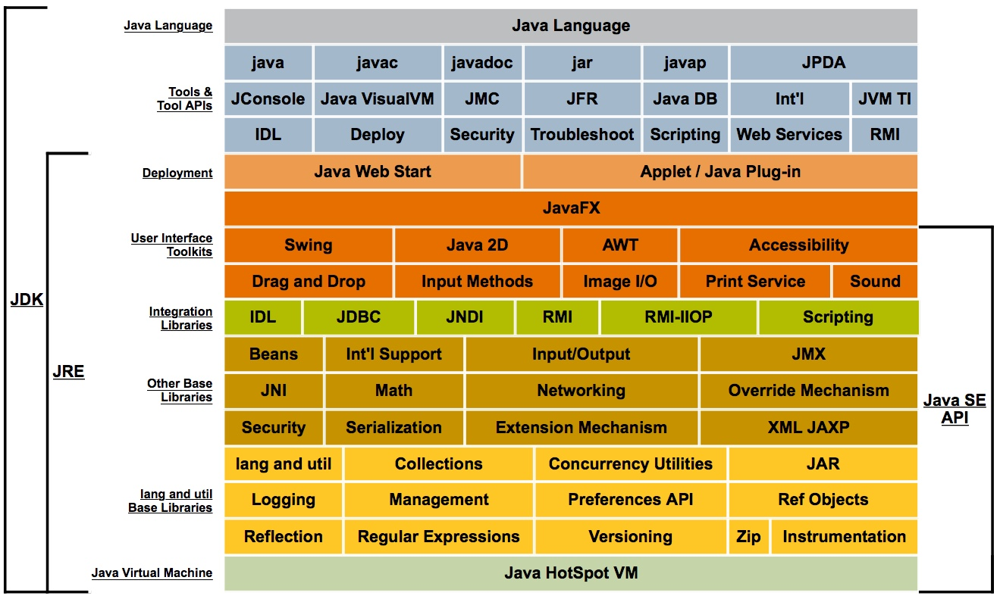

# 第一部分 走近Java
## 第一章 走近Java
### 1.1 概述
java的优点：实现了热点代码检测和运行时编译及优化

### 1.2 Java技术体系

### 1.3 Java发展史
JDK1.2内置了JIT（Just In Time）编译器（JDK 1.2中曾并存过三个虚拟机，Classic VM、HotSpot VM和Extract VM）

JDK1.5版本改变了Java的内存模型

JDK1.6版本提供动态语言支持（通过内置Mozilla JavaScript Rhino引擎实现）、提供编译API和微型HTTP服务器API等。同时对虚拟机内部做了大量改进，包括锁与同步、垃圾收集、类加载等方面的算法。

在JDK1.7中，Sun JDK和OpenJDK除了代码文件头的版权注释外，代码基本上完全一样，所以OpenJDK 7与Sun JDK 1.7本质上就是同一套代码库开发的产品。

JDK 1.7的主要改进包括：提供最新的G1收集器、加强对非Java语言的条用支持（JSR-292）、升级类加载架构。

### 1.4 Java虚拟机发展史

1.4.2 Sun HotSpot VM

HotSpot VM的热点代码探测能力可以通过执行计数器找出最具有编译价值的代码，然后通知JIT编译器以方法为单位进行编译。如果一个方法被频繁调用，或方法中有效循环次数很多，将会分别处罚标准编译和OSR（栈上替换）编译动作。通过编译器与解释器恰当的协同工作，可以在最优化的程序响应时间与最佳执行性能中取得平衡，而且无须等待本地代码输出才能执行程序，即时编译的时间压力也相对减小，这样有助于引入更多的代码优化技术，输出质量更高的本地代码。

在2008年和2009年，Oracle公司分别收购了BEA公司和Sun公司，这样Oracle就同时拥有了两款优秀的Java虚拟机：JRockit VM和HotSpot VM。Oracle公司宣布在不久的将来（大约应在发布JDK 8的时候）会完成这两款虚拟机的整合工作，使之优势互补。整合的方式大致上是在HotSpot的基础上，移植 JRockit 的 优秀 特性， 譬如使用JRockit的垃圾回收器与MissionControl服务，使用HotSpot的JIT编译器与混合的运行时系统。

1.4.6 Apache Harmony/Google Android Dalvik VM

Dalvik VM并不是一个Java虚拟机，它没有遵循Java虚拟机规范，不能直接执行Java的Class文件，使用的是寄存器架构而不是JVM中常见的栈架构。但是它与Java又有着千丝万缕的联系，它执行dex（Dalvik Executable）文件可以通过Class文件转化而来，使用Java语言编写应用程序，可以直接使用大部分的Java API等。目前Dalvik VM随着Android一起处于迅猛发展阶段，在Android 2.2中已提供即时编译器实现，在执行性能上有了很大的提高。

### 1.5 展望Java技术的未来
1.5.1 模块化

OSGi

1.5.2 混合语言

1.5.3 多核并行

JDK 1.5引入java.util.concurrent包实现了一个粗粒度的并发框架
JDK 1.7中加入了java.util.concurrent.forkjoin包是对concurrent包的一次重要扩充

函数式编程的一个重要优点就是天然的适合并行运行

Sumatra项目就是为Java提供使用GPU（Graphics Processing Units）和APU（Accelerated Processing Units）运算能力的工具。

Scala、Clojure及Erlang天生具备并行计算能力的语言

1.5.4 进一步丰富语法

[Coin项目](http://wikis.sun.com/display/ProjectCoin/Home)

[Lambda项目](http://openjdk.java.net/projects/lambda)

1.5.5 64虚拟机

### 1.6 实战：自己编译JDK

